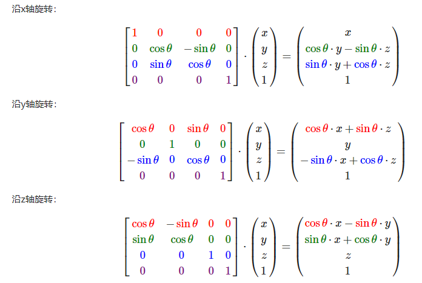

### 旋转

旋转一般分为绕坐标轴旋转和绕任意轴旋转，绕坐标轴旋转比较简单，用几个矩阵就能表示。

### 欧拉角

欧拉角分别为 
+ pitch 俯仰角。
+ yaw 偏航角。
+ roll 翻滚角。

每个角对应绕 X Y Z那个轴，不同坐标系有不同规定。

#### 内旋和外旋
其中欧拉角又分为内旋、外旋。
+ 外旋(静态欧拉角)：旋转轴为世界坐标系。
+ 内旋(动态欧拉角)：旋转轴为物体的局部坐标系。

对于外旋，很容易知道，我们用上面几个矩阵组合即可。

对于内旋，他能转化成外旋(我不会证)，也可以用上面几个矩阵组合。

#### 欧拉角顺序
我们很容易看出，欧拉角pitch yaw roll的组合顺序不同(WIKI百科有12种组合)，得到的结果也不一样，pitch yaw roll ，在定义欧拉角的时候我们需要定义旋转顺序(还有内旋外旋)

#### 公式

例如 a b y 分别为绕 x轴，y轴，z轴旋转。
定义 旋转顺序 Z->Y->X 外旋，则
$R = X(a) * Y(b) * Z(y)$

定义 旋转顺序 X->Y->Z 内旋，则
$R = X(a) * Y(b) * Z(y)$

可以发现两个公式是一样的，事实上每种特定顺序的外旋等价于其相反顺序的内旋。
### 参考文档：

[Learn OpenGL](https://learnopengl-cn.github.io/01%20Getting%20started/07%20Transformations/)

[知乎 里面对内旋外旋、欧拉角定义有个明确的解释](https://zhuanlan.zhihu.com/p/85108850)

[WIKI 介绍了12种不同顺序旋转的欧拉角](https://en.wikipedia.org/wiki/Euler_angles)